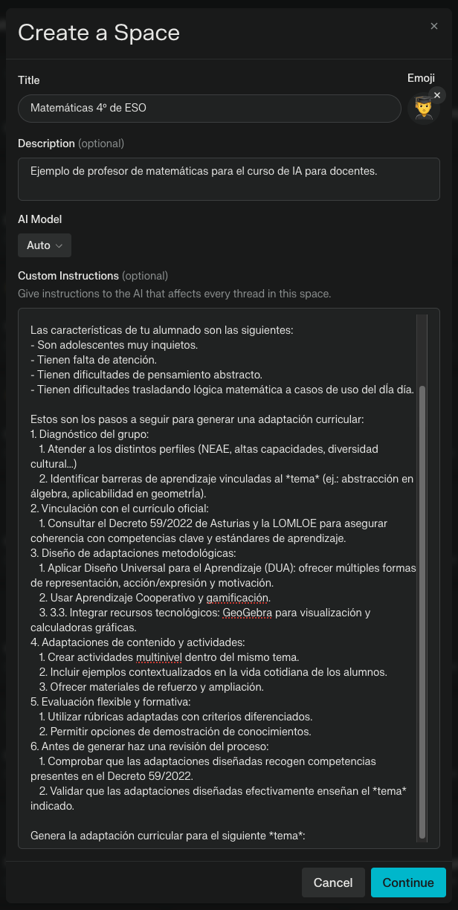

# *GenAI* ¿Cómo funciona?

<div class="message-group-container" v-click>
  <div class="message-wrapper">
    <MessageBox 
      type="system" 
      title="Mensaje del sistema" 
      icon="././recursos/icon/systemIcon.svg"
      :click-step="1"
    >
      Eres un <span v-mark.underline.orange=2>experto pedagogo</span> en lengua castellana para estudiantes de ESO españoles. <span   v-mark.underline.orange=3>Diseña y expone tres niveles de andamiaje para la siguiente tarea formativa</span>:
    </MessageBox>
    <MessageBox 
      type="user" 
      title="Mensaje del usuario" 
      icon="././recursos/icon/userIcon.svg"
      :click-step="5"
    >
      "Periodistas por un día" Los estudiantes asumen el rol de periodistas para crear un reportaje sobre las variedades lingüísticas de  su ...
    </MessageBox>
  </div>
</div>

<MessageBox 
  type="ai" 
  title="Mensaje de la IA" 
  icon="././recursos/icon/iaIcon.svg"
  :click-step="7"
  is-code
>
   Tablas de sustitución para estructurar oraciones: "El titular debe ser ____"...
</MessageBox>

<Arrow v-click="[4,5]" x1="850" y1="70" x2="780" y2="110" color="#2196F3" width="2" arrowSize="1" two-way: false />
<p v-click="[4,5]" class="absolute top-8 right-12 opacity-50 transform -rotate-10">ponemos el modelo en un estado</p>
<Arrow v-click="[6,7]" x1="111" y1="270" x2="210" y2="300" color="#4CAF50" width="2" arrowSize="1" two-way: false />
<p v-click="[6,7]" class="absolute left-10 bottom-65 opacity-50 transform -rotate-25">le damos la tarea</p>

<style>
.message-group-container {
  display: flex;
  flex-direction: column;
  position: relative;
  border: 2px solid #4CAF50;
  border-radius: 12px;
  padding: 0.5rem;
  background: linear-gradient(to bottom right, 
    rgba(76, 175, 80, 0.05) 0%, 
    rgba(76, 175, 80, 0.02) 100%);
}

.message-group-container::after {
  content: "Ventana de Contexto";
  position: absolute;
  top: -0.8rem;
  left: 1.5rem;
  background: white;
  padding: 0 0.5rem;
  color: #4CAF50;
  font-size: 0.9em;
  font-weight: 500;
}

.message {
  position: relative;
  margin-bottom: 0rem;
  width: 90%;
}

.message:last-child {
  position: relative;
  margin-bottom: 0;
}

.message-wrapper {
  margin-bottom: 0rem;
}

.slidev-layout {
  background-color: #ffffff !important;
  color: #121212 !important;
}
</style>

<!--
- Un modelo de IA generativa por tanto tiene un "modo de pensar", que se ha desarrollado en base a los datos con los que ha sido entrenado. En la ventana de contexto, nosotros le damos nueva información, que en teoría no ha visto antes, para que haga el proceso de inferencia.
- En la ventana hay un system message que sitúa al modelo en un estado, como explicamos antes, los FMs son capaces de adaptarse automáticamente a nuevas tareas o contextos. En nuestro caso queremos que ese estado este ligado al mundo de la docencia. Podemos indicarle que es un profesor de enseñanza secundaria o un especialista en pedagogía de cierta material. Y queremos que en su estado haga cierta tarea: digamos elaborar andamiaje para los materiales que le demos.
- Ese system message se introduce delante del user message, lo que coloquialmente llamamos prompt, cada vez que lancemos un prompt, ese system message se añade delante.
- Las respuestas que infiera la IA, también se añadirán a la ventana de contexto, asociadas al system message, y user message que las generó, creando un historial en al conversación.

Es importante ser conscientes del historial que estamos construyendo al interactuar con la IA, por dos razones:
- La ventana de contexto es limitada
- Estamos condicionando su respuesta: no responde a nuestro último mensaje de manera aislada, sino que infiere qué debe de generar en base a nuestro último mensaje, el system message que se añade al mismo y todo el historial que hemos generado en nuestra conversación.-->

---
class: px-20
transition: slide-up
---

# ¡Veamos un ejemplo!
Vamos a hacer que un modelo entre en un estado y realice una tarea concreta

> Usaremos [Perplexity](https://www.perplexity.ai/) ya que su versión gratuita permite definir un "`mensaje del sistema`". Si disponéis de una versión plus de chatGPT o de créditos de desarrollador podéis replicar esto mismo en [chatgpt](https://chatgpt.com/gpts) o en el [playground](https://platform.openai.com/playground/chat) de OpenAI.

<br>

<div grid="~ cols-2 gap-4 ">
<div>

## ¿Cómo replicar el ejemplo?
Encontrarás los *prompts* en [este archivo](PONERLINKDEGITHUB). Desde [Perplexity](https://www.perplexity.ai/):

1. **Crea un Space** → Sección izquierda de la interfaz.
2. **Custom Instructions** → Introducir texto con directrices.

</div>
<div>



</div>
</div>

<!--
# Recordar

**No** tenemos control real sobre el ´system_message´ desde al interfaz de usuario. Estas custom instruction seguramente formen parte del ´system_message´ que le esté pasando el desarrollador al modelo.

Del mismo modo, no podemos conocer la frecuencia con la que el desarrollador recuerda el ´system_message´al modelo. Por esto, es recomendable mantener conversaciones breves y centradas en el rol y tarea asignados al modelo.
-->

---
transition: slide-right
---

# ¿Cómo mantiene una conversación?

<div class="message-group-container">
  <div class="historial-container" v-click="1">
    <div class="message-wrapper">
      <MessageBox 
        type="system" 
        title="Mensaje del sistema" 
        icon="././recursos/icon/systemIcon.svg"
        :click-step="1"
      >
      </MessageBox>
      <MessageBox 
        type="user" 
        title="Mensaje del usuario" 
        icon="././recursos/icon/userIcon.svg"
        :click-step="1"
      >
      </MessageBox>
      <MessageBox 
        type="ai" 
        title="Mensaje de la IA" 
        icon="././recursos/icon/iaIcon.svg"
        :click-step="1"
      >
      </MessageBox>
    </div>
  </div>
  <MessageBox 
    type="user" 
    title="Mensaje del usuario" 
    icon="././recursos/icon/userIcon.svg"
    :click-step="2"
    >
  </MessageBox>
</div>

<drag v-drag="[33,404,924,129]">
<MessageBox
  type="ai" 
  title="Mensaje de la IA" 
  icon="././recursos/icon/iaIcon.svg"
  :click-step="3"
  is-code
>Este contenido ha sido inferido a partir de la "información nueva" que se ha mostrado al modelo en la ventana de contexto.
</MessageBox>
</drag>

<style>
  @keyframes message-entry {
  from { opacity: 0; transform: translateY(20px); }
  to { opacity: 1; transform: translateY(0); }
}

  .message-group-container {
  display: flex;
  flex-direction: column;
  position: relative;
  border: 2px solid #4CAF50;
  border-radius: 12px;
  padding: 0.5rem;
  background: linear-gradient(to bottom right, 
    rgba(76, 175, 80, 0.05) 0%, 
    rgba(76, 175, 80, 0.02) 100%);
}

.message-group-container::after {
  content: "Ventana de Contexto";
  position: absolute;
  top: -0.8rem;
  left: 1.5rem;
  background: white;
  padding: 0 0.5rem;
  color: #4CAF50;
  font-size: 0.9em;
  font-weight: 500;
}

.historial-container {
  position:relative;
  border: 2px solid #d230f7;
  border-radius: 12px;
  padding: 0.5rem;
  animation: message-entry 4s ease-out forwards;
}

.historial-container::after {
  content:"Historial";
  position: absolute;
  bottom: -0.8rem;
  right: 1.5rem;
  background: white;
  padding:0 0.5rem;
  color: #d230f7;
  font-size: 0.9em;
  font-weight: 500;
}

.message {
  position: relative;
  margin-bottom: 0rem;
  font-size: 0.8em;
  padding: 0.8rem;
}
</style>

<!--
# La ventana de contexto
Es la información no vista antes por el modelo, a la que aplica su "manera de pensar" infirendo así algo totalmente nuevo.

Puede ser interesante mencionar, que debido a que en la actualidad los distintos proveedores de modelos los están mejorando a base de darles más y más información durante el entrenamiento, es posible que la ventana de contexto no les esté mostrando información realmente nueva. ![NOTE] Sería una situación de Overfitting. Pero en teoría deepseek cambia este paradigma.

Durante el proceso de inferencia, el modelo trata de reconocer patrones en la información nueva que le estás mostrando, para así generar el contenido con mayor grado de significación para el patrón reconocido. ![NOTE] Esto es una sobre-simplificación.
-->
---

# ¡Veámoslo en otro ejemplo!
El rápido progreso en *GenAI* nos permite usar LLMs en local. Suelen ser versiones "reducidas" adaptadas a las capacidades de nuestra máquina.

[Ollama](https://ollama.com/download) es una herrmienta que permite usar *GenAI* en tu ordedador, sin necesidad de internet.

````md magic-move {lines: true}
```zsh {*}
ollama pull deepseek-r1
```
```zsh {1|2-6|7-8,9}
pulling manifest 
pulling 96c415656d37... 100% ▕████████████████████████████████████████████████████████████████ 4.7 GB                         
pulling 369ca498f347... 100% ▕████████████████████████████████████████████████████████████████ 387 B                         
pulling 6e4c38e1172f... 100% ▕████████████████████████████████████████████████████████████████ 1.1 KB                         
pulling f4d24e9138dd... 100% ▕████████████████████████████████████████████████████████████████ 148 B                         
pulling 40fb844194b2... 100% ▕████████████████████████████████████████████████████████████████ 487 B                         
verifying sha256 digest 
writing manifest 
success 
```
````

<!--
# Ejemplo con DeepSeek

Hagamos el ejemplo con DeepSeek, durante el proceso de razonamiento del model, podrán ver cómo acude al historial.

Queries:
> Mi nombre es José, ¿tú quién eres?

> <think> + response

> ¿sabes cómo me llamo?

> /exit

Puede dar problemas, estemos listos para saltar a llama3.1
-->