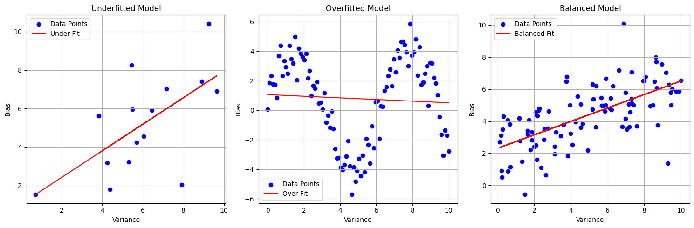

# **Explicabilidad**
versus la *interpretabilidad* y el **sesgo** y la **varianza**

> Un sistema con **[explicabilidad](https://www.ibm.com/es-es/cloud/learn/explainable-ai)** tiene herramientas que permiten comprender cómo se han alcanzado los resultados generados.

::left::

```mermaid {theme: 'default', alt: 'Construcción de Modelo Fundacional', scale: 0.60}
  flowchart TD
  A[Recolección de Datos]:::blue --> B{{Identificación de Patrones}}:::cyan
  B --> C[Creación de Modelo Fundacional]:::green
  C --> D[Introducción de Nueva Información]:::lime
  D --> E[Generación de Contenido]:::yellow

  classDef blue fill:#4285F4,color:white
  classDef cyan fill:#00BCD4,color:white
  classDef green fill:#4CAF50,color:white
  classDef lime fill:#8BC34A,color:white
  classDef yellow fill:#FFEB3B,color:black
```

::right::

<div class= "text-container">
    <p v-click="1" class="text-container_traning_data">
        Datos de entrenamiento <span style="color: rgb(44, 145, 179);">desconocidos</span>
    </p>
    <p v-click="2" class="text-container_traning">
        Proceso de entrenamiento <span style="color: rgb(44, 145, 179);">desconocidos</span>
    </p>
    <p v-click="3" class="text-container_inference">
        Proceso de inferencia <span style="color: rgb(44, 145, 179);">opaco</span>
    </p>
</div>
<br>
<div v-click="2" class="image-container">
    
</div>


<!--
# Datos entrenamiento desconocidos, así como proceso de selección de datos.
    Esto implica potencial existencia de sesgos entre clases.
# Proceso de entrenamiento desconocido
    No sabemos cómo han distribuido los pesos, que *features* han utilizado, etc.
# Proceso de inferencia opaco
    No sabemos cómo se efectúa el proceso de inferencia, ni los patrones que se seleccionan en las redes neuronales del modelo.

La inferencia forma parte de un proceso en el que la IA analiza datos que no ha visto antes. Pero
se puede dar el caso de que la IA sí haya visto antes los datos que le mostramos. Estaríamos ante
una potencial situación de *overfitting*, donde el modelo ha aprendido a memorizar los datos de entrenamiento en lugar de generalizar patrones.
Esto puede llevar a resultados inesperados o erróneos.

Varianza ≈ ruido en los datos
Sesgo ≈ error sistemático en los datos

**Interpretability** is a feature of model transparency. Interpretability is the degree to which a human can understand the cause of a decision.
**Interpretability** is the access into a system so that a human can interpret the model’s output based on the weights and features.


**Explainability** is how to take an ML model and explain the behavior in human terms. With complex models (for example, black boxes), 
you cannot fully understand how and why the inner mechanics impact the prediction. However, through model agnostic methods (for example, partial dependence plots, 
SHAP dependence plots, or surrogate models) you can discover meaning between input data attributions and model outputs. With that understanding, 
you can explain the nature and behavior of the AI/ML model.

-->

---
layout: "image-left"
image: "../recursos/privacy-dall·3.png"
---
# Privacidad y seguridad
Uso responsable de la IA

> No introducir **datos** ([personales](https://gdpr-info.eu/art-5-gdpr/)) **[sensibles](https://gdpr-info.eu/art-9-gdpr/)** 
> ni *[PII](https://gdpr-info.eu/art-4-gdpr/)*, o **información confidencial** en un sistema de procesamiento de un proveedor no autorizados 
> expresamente ni que incumplan las normativas de RGPD o los principios éticos de la Consejería y vuestro centro.

<div class="iapp-container">
    
    <p class="iapp-text">
        <a href="https://iapp.org/" 
        target="_blank">IAPP</a> 
        como fuente fiable para explorar mejores prácticas en privacidad</p>
</div>

<br>

<ul class="can">
    <li v-click="1" class="check">Crear materiales didácticos</li>
    <li v-click="3" class="check">Buscar ideas creativas para la clase</li>
    <li v-click="4" class="check">Generar y diseñar contenido</li>
</ul>

<ul class="no-can">
    <li v-click="2" class="cross">Adaptaciones basadas en datos personales</li>
    <li v-click="5" class="cross">Generar contenido basado en datos personales</li>

</ul>

<style>
.iapp-container {
    display: flex;    
    align-items: center;
    margin-top: auto;
    position: absolute;
    bottom: 20px;
}

.iapp-logo {
    width: 50px;
    margin-right: 10px;
}

.iapp-text {
    font-size: 0.7em;
    color: #aaa;
}
.can{
    list-style: none;
    padding-left: 0;
}
.can li.check::before {
    content: "✅";
    font-size: 0.7em;
    margin-bottom: 10px;
    margin-left: -10px;
    margin-right: 15px;
}
.no-can{
    list-style: none;
    padding-left: 0;
}
.no-can li.cross::before {
    content: "❌";
    font-size: 0.7em;
    margin-bottom: 10px;
    margin-left: -10px;
    margin-right: 15px;
}
</style>

<!--
Uso PII en vez de datos personales (como se refiere a estos en el RGPD) porque es un término más comúnmente usado.

A fecha de hacer esta diapositiva, no he encontrado información que indique que la Consejería de Educación de Asturias
haya dado autorización expresa para emplear Microsoft Copilot a pesar de que Microsoft es proveedor de Office 365 para 
la consejería.

Entiendo que la autorización expresa por la Consejería de Educación de Asturias implica que se ha informado a los 
*data owners* de cómo y con qué finalidad se van a usar sus datos, y que se ha recogido un consentimiento expreso. Así 
mismo, se han cumplido con todos los requisitos legales de nuestra jurisdicción.
-->

---
layout: "two-cols"
---
# Retos en GenIA
Las dimensiones de la IA responsable


<br>
<h4 v-click="1"> Toxicidad y contenido dañino</h4>
<br>
<h4 v-click="2"> Información sesgada</h4>
<br>
<h4 v-click="3"> Alucinaciones</h4>
<br>
<h4 v-click="4"> Propiedad intelectual</h4>
<br>
<h4 v-click="5"> Plagio y fraude</h4>
<br>
<h4 v-click="6"> Disrupción estructural del trabajo </h4>


::right::
<br>
<div class="image-container">
    
</div>

---
layout: "center"
class: "text-center"
---
# Retrieval-Augmented Generation (RAG)
Generación a partir de información externa

**[Enriquezcamos]{style="color: rgb(44, 145, 179);"}** la ventana de contexto.

<div class="video-container">
    <Youtube id="T-D1OfcDW1M"/>
</div>

<style>
.video-container {
    position: relative;
    padding-bottom: 56.25%; /* 16:9 */
    height: 0;
    overflow: hidden;
    max-width: 100%;
}
.video-container iframe {
    position: absolute;
    top: 0;
    left: 0;
    width: 100%;
    height: 100%;
}
.video-container .youtube-embed {
    width: 100%;
    height: 100%;
}
.video-container .youtube-embed {
    position: absolute;
    top: 0;
    left: 0;
    width: 100%;
    height: 100%;
}
</style>
---
layout: "two-cols"
image: " "
class: "text-sm"
---
# Empleemos la recuperación aumentada para hacer andamiaje
Introduciendo en la ventana de contexto el material didáctico que queremos usar de base,
y pidiéndole al modelo que de **atención** a la normativa aplicable.

Haremos dos [ejemplos]():
- Empleando una herramienta proveedor de IA generativa en cloud.
- Empleando una herramienta de IA generativa en local: [Msty](https://msty.app/)^[TOS de la licencia gratuita de Msty no permiten su uso comercial]

::right::
[Le Chat](https://chat.mistral.ai/), [Gemini](https://gemini.google.com), o [chatGPT](https://chat.openai.com/) nos permiten que el modelo
recupere información de internet para enriquecer su ventana de contexto, así como adjuntar documentos o archivos de texto.

Para el ejemplo "en cloud" usaremos de nuevo [Perplexity](https://www.perplexity.ai/), que nos permite una demostración más granular.

<!--
Gemini no nos permite controlar si usa el internet como data-store.

Anthropic a lanzado un modelo de Claude para la educación (universitaria en USA, UK, y Canada) para fomentar
un uso que haga incapié en el pensamiento crítico.
-->