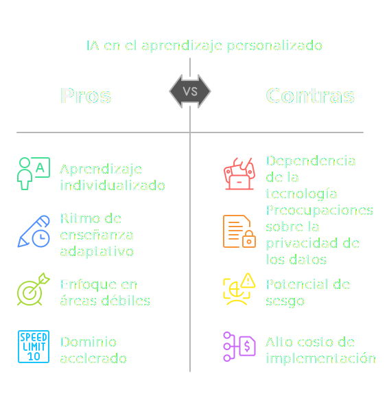
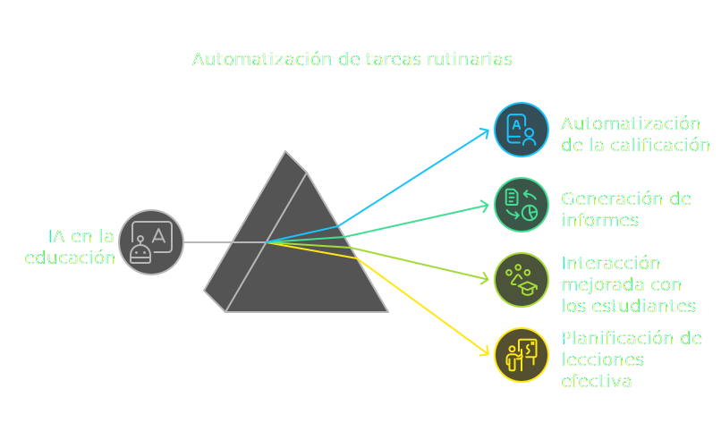
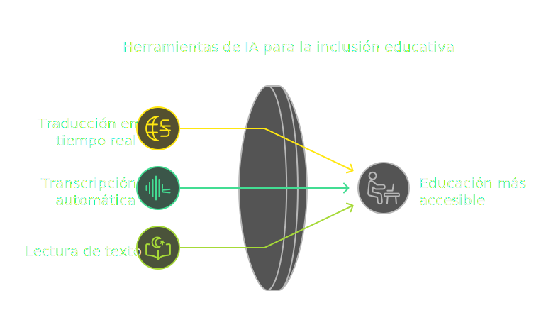
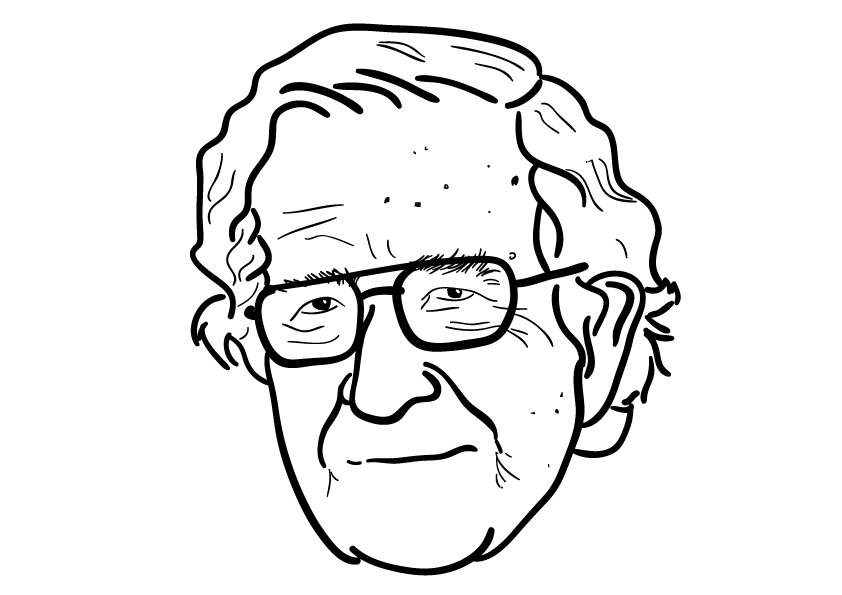
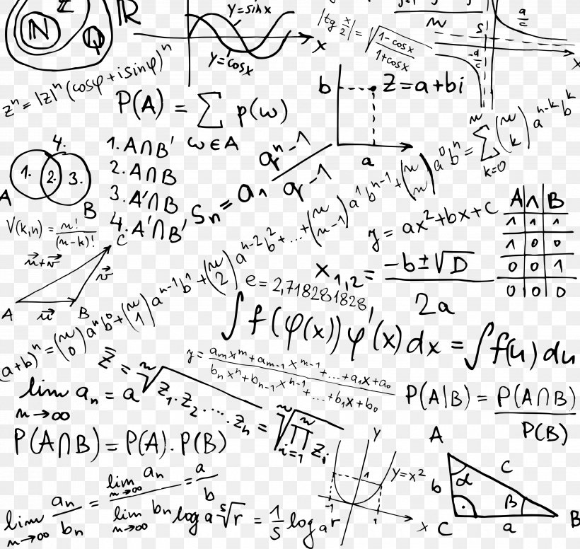
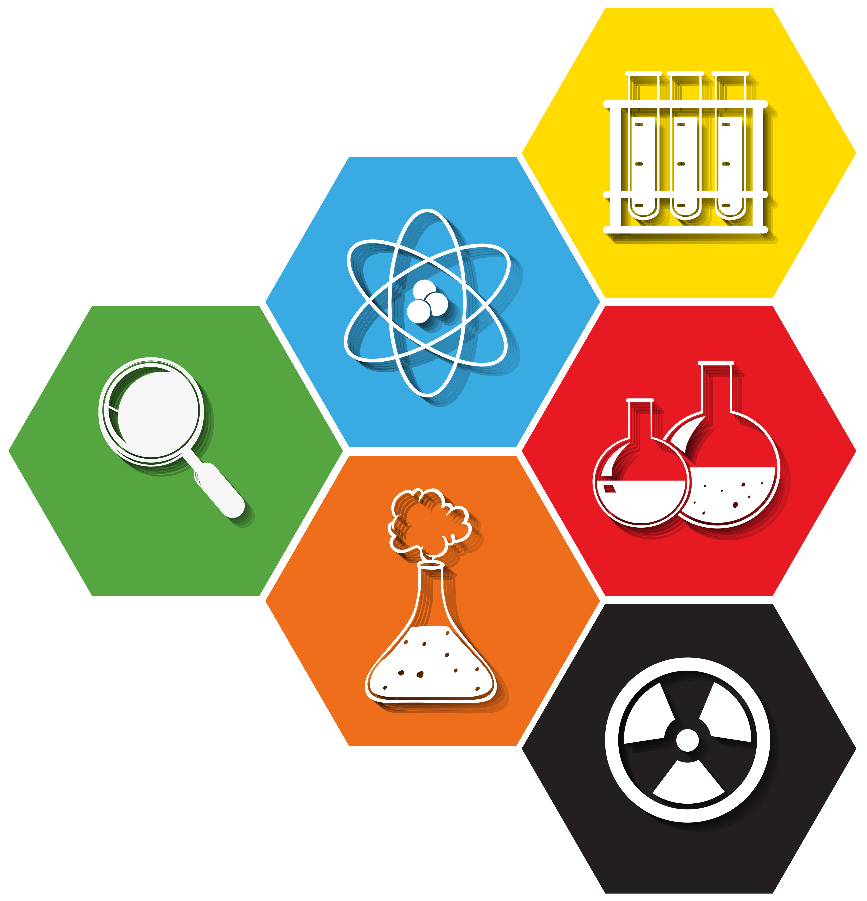
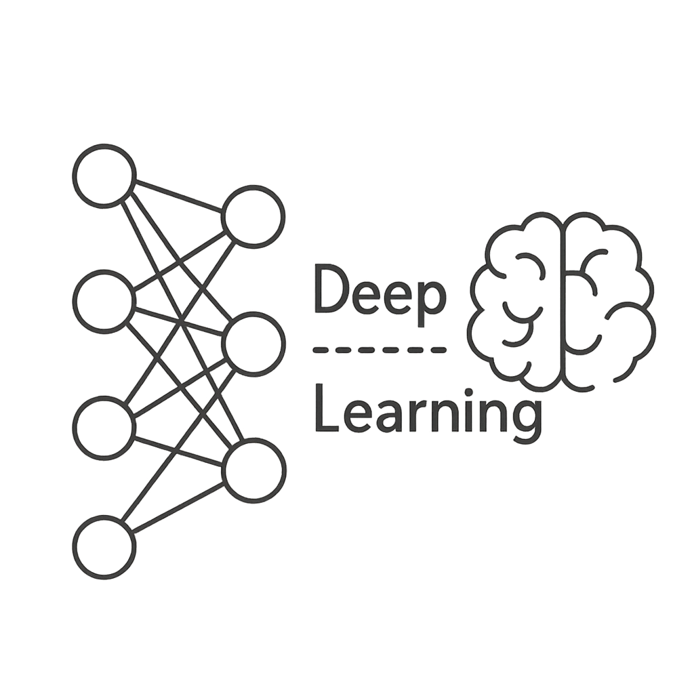

# Introducción a la Inteligencia Artificial para Docentes

IES Carmen y Severo Ochoa

8 de abril de 2025

<!-- Dar las gracias a todos los participantes por unirse.
# Antes de comenzar:

  - ¿Han traído sus portátiles?
  - Que los enciendan ya que los vamos a usar
  - No se preocupen por tomar notas que les voy a pasar todos los materiales.
 -->
---
transition: fade-out
---

# José María Llorián Álvarez

¿Quién soy y qué hago aquí?

<br>

<br>
<br>
<br>
<br>
<br>

<div v-click>  </div>


👋 ¡Hola! Soy un apasionado del **[aprendizaje]{style="color: rgb(44, 145, 179);"}** y la innovación.
He liderado el desarrollo de sistemas de búsqueda potenciados por IA así como *chatbots*, creando experiencias que combinan tecnología y <span v-mark.circle.orange>creatividad.</span>

<br>
<div v-click="3">
  📍 Navia, Asturias, España  
  ✉️ josellorian@gmail.com | <a href="https://www.linkedin.com/in/llorian">LinkedIn</a>
</div>

<div v-click="3" class= "credentials-container">

  <a href="https://www.credly.com/badges/88da6527-1f37-41b5-bf4a-ce433e133dfc/public_url" 
    target="_blank" 
    style="text-decoration: none;">
    
  </a>

  <a href="https://www.credential.net/819ca9ca-d3c5-440f-bc4a-ae59fb56fe21#acc.ymNDFpa1" 
    target="_blank" 
    style="text-decoration: none;">
    
  </a>
</div>

<div class="slide-counter">
  <SlideCurrentNo />/<SlidesTotal />
</div>

<style>
  .credentials-container {
    display: flex;
    justify-content: center;
    align-items: flex-end;
  }
</style>

---
transition: slide-up
---

# Nuestros objetivos para hoy:

<ul>
  <li v-click="1">🤓 <span v-mark.red="4"><b>Saber</b></span> qué es la IA a nivel general y el <i>GenAI</i> a nivel particular.</li>
  <li v-click="2">🧠 <span v-mark.red="5"><b>Aprender</b></span> a usar la IA de manera responsable.</li>
  <li v-click="3">🤖 <span v-mark.red="6"><b>Usar</b></span> la IA para elaborar adaptaciones, generar andamiaje, y refinar material en el marco de una programación docente y teniendo en cuenta los criterios de evaluación.</li>
</ul>
<br>

<style>
h1 {
  background-color: #2B90B6;
  background-image: linear-gradient(45deg, #4EC5D4 10%, #146b8c 20%);
  background-size: 100%;
  -webkit-background-clip: text;
  -moz-background-clip: text;
  -webkit-text-fill-color: transparent;
  -moz-text-fill-color: transparent;
}
</style>

---
transition: slide-up
---

# La relevancia de la IA en educación







<style>

.overlay-item {
  position: fixed;
  top: 50%;
  left: 50%;
  transform-origin: center;
  transform: translate(-50%, -50%);
  max-width: 90%;
  max-height: 80%;
  object-fit: contain;
  opacity: 0.9;
  transition: transform 0.3s ease, opacity 0.3s ease;
}

.overlay-item:hover {
  transform: translate(-50%, -50%) scale(1.1);
  opacity: 1;
}

.slidev-vclick-target {
  transition: all 800ms ease;
}

.slidev-vcklick-hidden {
  opacity: 0;
  transform: scale(0.8);
  pointer-events: none;
}

h1 {
  background-color: #2B90B6;
  background-image: linear-gradient(45deg, #4EC5D4 10%, #146b8c 20%);
  background-size: 100%;
  -webkit-background-clip: text;
  -moz-background-clip: text;
  -webkit-text-fill-color: transparent;
}

.slidev-layout {
  background-color: #121212 !important;
  color: #ffffff !important;
}
</style>

<!--
Esta slide muestra las ventajas del uso de la IA en educación.
Pero de todo tipo de IA, como se verá más adelante, esta formación se enfoca en el uso de IA generativa.

- Aprendizaje personalizado: La IA puede adaptar el contenido y el ritmo de aprendizaje a las necesidades
  individuales de cada estudiante, lo que permite una educación más personalizada y efectiva. Más adelante, 
  veremos cómo podemos construir andamiaje para apoyar a nuestros alumnado de manera personalizada.

- Automatización de tareas: La IA puede ayudar a los docentes a automatizar tareas administrativas y repetitivas,
  como la corrección de exámenes o la gestión de horarios, lo que les permite centrarse en la enseñanza y el 
  aprendizaje. Más adelante veremos cómo podemos usar la IA para generar materiales educativos.

- Inclusión educativa: La IA puede facilitar la inclusión de estudiantes con necesidades especiales al ofrecer
  herramientas y recursos adaptados a sus necesidades. Más adelante veremos cómo podemos usar la IA para 
  generar materiales educativos adaptados a la diversidad del alumnado.

El contenido de esta slide y la descripción para el presentador que la acompañan ha sido generado al 100% por IA.
-->

---
src: ./pages/IA-ML-DL.md
hide: true
transition: fade
---
---
src: ./pages/AI-ML-DL-interactivo.md
hide: false
transition: fade
---
---
class: text-center
transition: slide-up
---

# IA Generativa
GenAI

<div class="grid grid-rows-3 gap-4 items-center">

  <!-- Fila superior: Imágenes encima de "Datos diversos" -->
  <div v-click="1" class="flex justify-center space-x-4">
    
    
    
  </div>

  <!-- Fila central: Diagrama Mermaid -->

```mermaid {theme: 'default', alt: 'Construcción de Modelo Fundacional', scale: 0.60}
  flowchart LR
  A[Recolección de Datos]:::blue --> B{{Identificación de Patrones}}:::cyan
  B --> C[Creación de Modelo Fundacional]:::green
  C --> D[Introducción de Nueva Información]:::lime
  D --> E[Generación de Contenido]:::yellow

  classDef blue fill:#4285F4,color:white
  classDef cyan fill:#00BCD4,color:white
  classDef green fill:#4CAF50,color:white
  classDef lime fill:#8BC34A,color:white
  classDef yellow fill:#FFEB3B,color:black
```

  <!-- Fila inferior: Imágenes debajo del diagrama -->
  <div class="flex justify-center space-x-4">
    <div class="absolute" v-click="[2,3]">
      
    </div>
    <div text-align="left" v-click="3">
      <li>🤓
      El modelo aprende a <span v-mark.red="4">identificar patrones</span> a partir de datos de múltiples dominios
      </li>
      <li>🧐
      Le mostramos datos que no ha visto antes...
      </li>
      <li>🤖
      Y el modelo <span v-mark.circle.orange="5">infiere</span> de manera creativa
      </li>
    </div>
    
  </div>
</div>

<style>
.grid {
  text-align: center;
}
img {
  transition: transform 0.3s ease;
}
img:hover {
  transform: scale(1.1);
}
:deep(.mermaid rect) {
  fill: #F0F4F8;
  stroke: #1E3A8A;
  transition: all 0.3s ease;
}

:deep(.mermaid-node-active) {
  filter: drop-shadow(0 0 8px #3B82F6);
}
</style>

<!--
Un modelo de IA generativa es el producto de un proceso de entrenamiento en el que se le ha enseñado a un modelo a generar contenido nuevo, como texto,
imágenes o música, a partir de patrones aprendidos en datos existentes. Estos modelos son capaces de crear **contenido original y creativo**, lo que los
hace útiles en una variedad de aplicaciones, desde la generación de arte hasta la escritura automática.

Flujo:
1. gran cantidad de datos diversos
2. deep learning
3. Modelo Fundacional (sabe de linguística, arquitectura, código, matemáticas...) – esto es una simplificación, podría ser un modelo de IA generativa entrenado en un dominio específico.
4. Generación de contenido nuevo (texto, imágenes, música, etc.) a partir de patrones aprendidos en los datos (su manera de pensar) y nueva información (ventana de contexto).

Al final, un FM, es un modelo de IA generativa que tiene multiples sombreros y maneras de pensar.
-->
---
class: text-center
transition: slide-down
---

# Tipos de GenAI

¿Clasificaciones?¿Cuántos conocéis?

<div v-click>
```mermaid {theme: 'default', alt: 'Taxonomía basada en arquitectura', scale: 0.8}
graph TD
A[Algunos tipos de GenAI] --> B[GANs]
A --> C[VAEs]
A --> D[Transformers]
A --> E[Diffusion]
A --> F[Flow]
```
</div>

<div class="text-sm" style="scale:0.85">

| <div v-click class="text-center">**Tipo de entrada**</div>   | <div v-click class="text-center">**Salida**</div>             |
| ---------------------------------------- | ----------------------------------------- |
| <kbd v-click="3">Texto</kbd>             | <div v-click="3">Texto, código, ...</div> |
| <kbd v-click="3">Texto</kbd>             | <div v-click="3">Imagen</div>             |
| <kbd v-click="4">Imagen</kbd>            | <div v-click="4">Imagen modificada</div>  |
| <kbd v-click="5">Audio</kbd>             | <div v-click="5">Texto/audio</div>        |
| <kbd v-click="6">Multimodal</kbd>        | <div v-click="6">Cualquier formato</div>  |

</div>
<!--
Hay múltiples taxonomías.

La primera que mostramos es en base a su arquitectura, y la segunda es dependiendo del tipo de entrada y salida.

- Generative Adversarial Networks -> Dos sistemas rivales, uno genera contenido y otro lo evalúa para detectar si es real o artificial. Ej: Artista y crítico de arte.
- Variational Autoencoders -> Comprinen información y la regeneran con variaciones. Ej: Resumen de docuemntos.
- Diffusion -> De imagen borrosa a resultado nítido (o viceversa).
- Flow -> transformaciones reversibles desde números aleatorios.
- Faltan muchos tipos más: Autorregresivos, energéticos, y claro, híbridos.
-->

---
src: ./pages/context-window.md
hide: false
transition: fade in
---
---
src: ./pages/risks-bias-rag.md
transition: slide-left
---
---
src: ./pages/glosario.md
transition: slide-left
---
